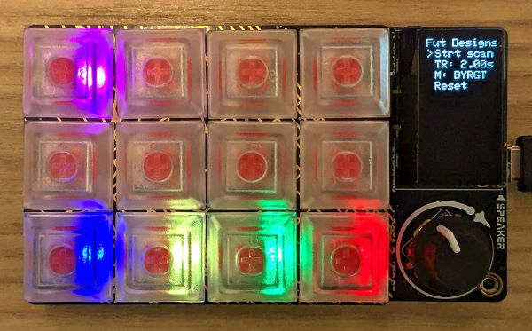

# Future Designs: An emulated Current Designs 932 + button box.

This uses an [Adafruit MacroPad RP2040](https://www.adafruit.com/product/5128) to emulate some of the behavior of using button boxes through the [Current Designs 932](https://www.curdes.com/fiu-932b.html) interface.

The initial goal is to match the experience of using one of the [button boxes](https://www.curdes.com/mainforp/responsedevices/buttonboxes.html) in both the MRI or MEG suites in BrainWorks, such that researchers can develop their tasks without needing to access these limited facilities.

For device usage, see [USAGE.md](USAGE.md). There's also a Psychtoolbox-based `BWKbQueueDemo.m` that I used to test the button and fake trigger behavior.

## Technical Details

### Design

The general division of labor is:

core 0:
  - Input handling (e.g. reading pin states, reading rotary encoder direction...)
  - Device state tracking (what's pressed/released, menu state...)
  - HID communication (i.e. send keypresses/releases)

core 1:
  - UI updates (LEDs, screen, sound (in future))

Messages are passed from core 0 to 1 via the [hardware FIFO](https://arduino-pico.readthedocs.io/en/latest/multicore.html#communicating-between-cores). The device state is packed into a struct comprised of [bit fields](https://en.cppreference.com/w/cpp/language/bit_field), which can be easily serialized/deserialized.

### Build

I used the [Arduino IDE](https://www.arduino.cc/en/software), version 2.3.4. I additionally installed the [Arduino Pico Core](https://github.com/earlephilhower/arduino-pico) through the library manager, along with Adafruit libraries to support the SH1106G display, neopixels, rotary encoder, and USB.

One manual change I made was to bump the required C++ version to C++20 by setting the `-std=gnu++20` flag under the `compiler.cpp.flags` option in the "platform.txt" file. On my Windows machine, that file was located at `C:\Users\...\AppData\Local\Arduino15\packages\rp2040\hardware\rp2040\4.3.1`, though YMMV. The version increase allowed me to try out bit fields to ease passing date between the two RP2040 cores.

The "Adafruit TinyUSB" stack must be selected under "Tools->USB Stack". I also set the `-O3` optimization flag for the final build, which seemed to reduce jitter on the UI core.

By default, the MacroPad is configured to only expose a keyboard interface. The CDC & mass storage interfaces can be enabled if button 0 (the one in the top right corner, if the MacroPad is oriented to match our configuration) is held during reset. To reset, either replug the USB cable into the computer, or press the "reset" button adjacent to the Stemma QT port. If successful, the string "DEV MODE" should be printed on the bottom of the display.

To actually upload, make sure that the MacroPad is connected to the computer and has the mass storage mode enabled, and that the "Adafruit MacroPad RP2040" is selected in the board dropdown menu. Then click the `->` arrow to compile & upload to the MacroPad.

### Debugging

For extended debugging/development, there's a `DEBUG` flag that if defined, ensures the CDC & mass storage endpoints are always enabled, calls the initial `Serial` setup, and measures the UI loop duration. The developer can then sprinkle in `Serial.print(...)` as needed. More elaborate debugging may be possible, but I haven't tried it yet.
