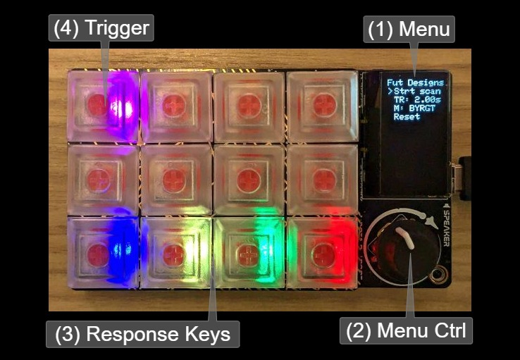

# MRI/MEG Response Box Emulator

We developed the [Future Designs](https://github.com/BrainWorks/future-designs) button box to ease development of fMRI and MEG tasks. It emulates the experience of connecting to the [Current Designs 932](https://www.curdes.com/fiu-932b.html) interface, with up to 4 buttons and the scanner trigger available. It is compatible with all operating systems.

### Layout and usage

1. You can control the menu with the dial (2). The menu options are:
    a. `Strt Scan`: Start or stop trigger simulation. When selected, this will send periodic `T`s or `5`s to the computer, depending on the button box mode.
    b. `TR: X.XXs`: Set the TR interval of the simulated triggers in 0.1s steps (range 0.5-3.0s).
    c. `M`: Change the button box mode. Options match those available through the 932 and are:
        - `BYRGT` (Letters, autorelease)
        - `12345` (Numbers, autorelease)
        - `NAR B` (Letters, no autorelease)
        - `NAR 1` (Numbers, no autorelease)
    d. `Reset`: Reset to the default settings.
    
    Additionally, a running TR count will be shown at the bottom of the menu when `Strt Scan` is selected.

2. You can turn menu control clockwise or counterclockwise, and press to select an option. When one of the menu options is selected, the `>` will turn into a `*` and turning will cycle through submenu options. You can confirm the submenu option by pressing the control knob again.
    - For example, selecting the `M` row and turning clockwise will cycle through the mode options.

3. The response keys, from left to right, are `B`/`1`, `Y`/`2`, `G`/`3`, and `R`/`4`.

4. The trigger key is `T`/`5`, and is either automatically triggered by selecting `Strt Scan`, or manually triggered by pressing the purple key.

### Additional notes

 - When initially connecting the keyboard to a Mac, you may get prompted with a "Identify your keyboard layout" question. You can ignore and close this dialog.

 - When idle for more than a few minutes, the Future Designs display will turn off and the button LEDs will dim. You can wake the device by pressing any of the keys or turning the dial.

 - If you're using PsychoPy to write tasks, the `NAR` (no autorelease) modes are likely more intuitive to work with. To present more immediate feedback, you might have set `waitRelease=False` when checking for keyboard keys, which returns keys that have been pressed, but not released yet. In autorelease mode, the key is signaled as being "released" immediately after a press (usually <1ms later). This means that PsychoPy only rarely sees the key as "pressed-but-not-released-yet", and so you might miss events altogether if you never use `getKeys()` with `waitRelease=True`. The `NAR` modes behave just like regular computer keyboards in that it signals a press when the key is down, and a release when the key is released. Your PsychoPy code will remain responsive, and work consistently across response devices.
